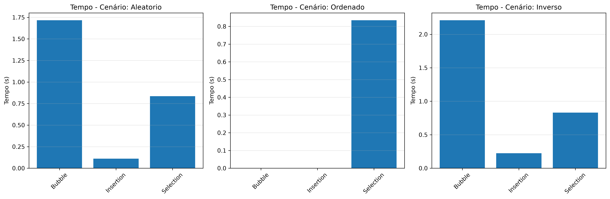
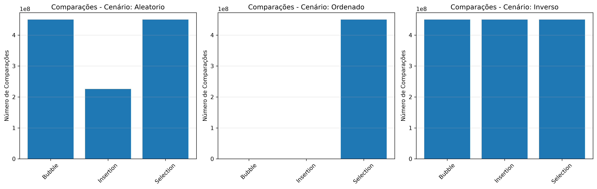
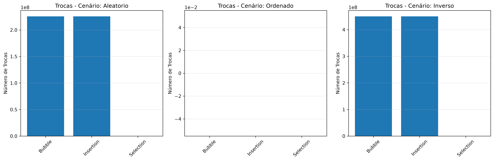
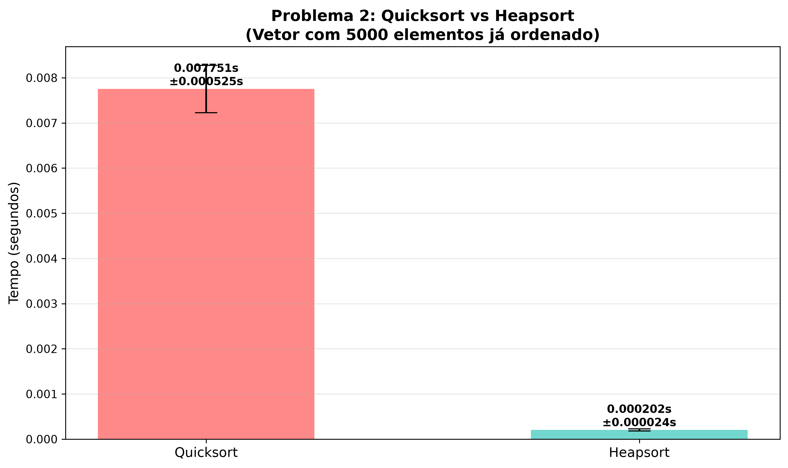
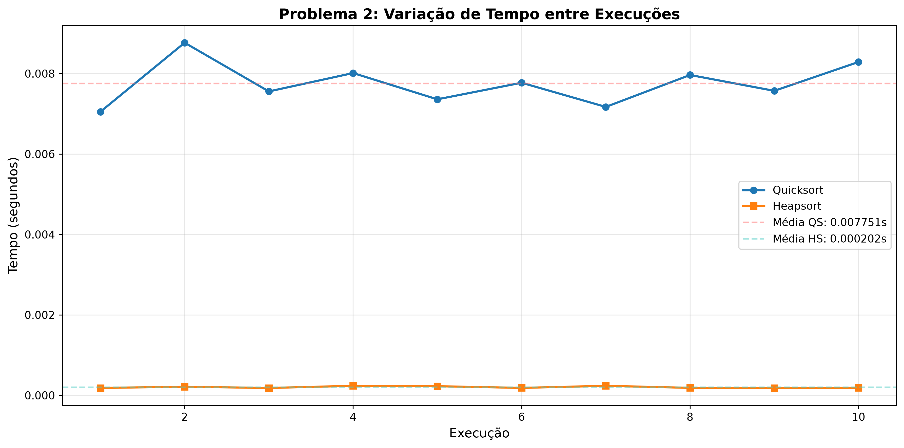
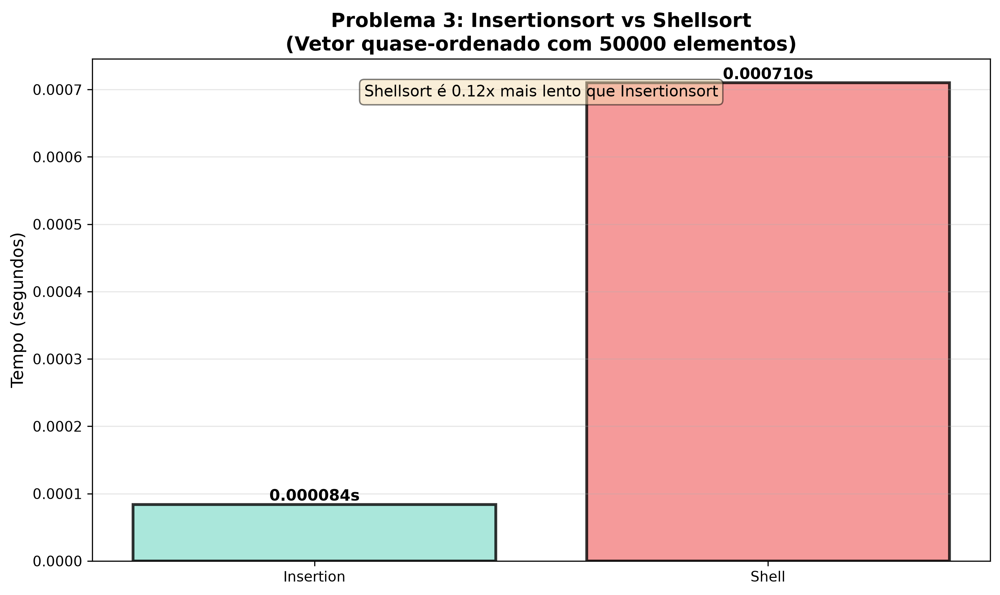
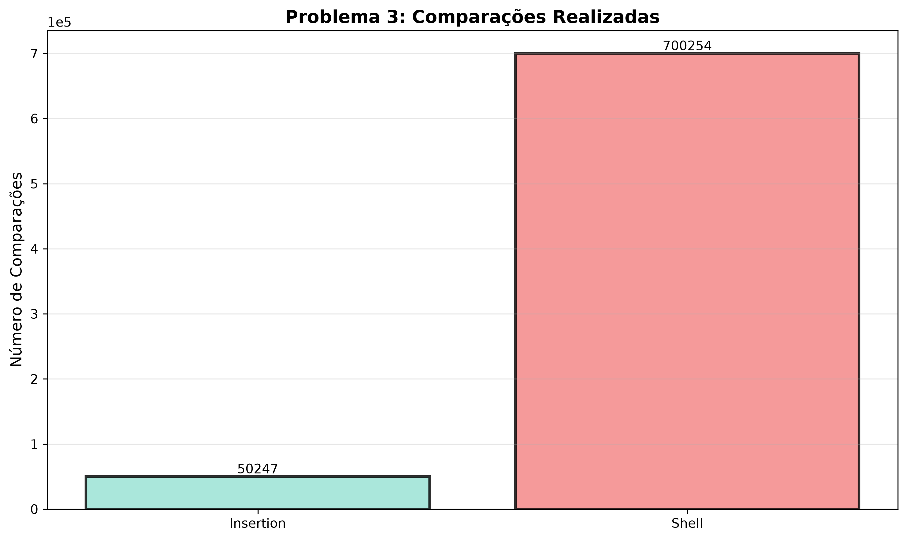

# Relatório de Execução - Benchmarking de Algoritmos de Ordenação

## 1. IDENTIFICAÇÃO

**Alunos:**
- Nome: Danilo Balman Garcia
- Matrícula: a2482088

- Nome: Rafael Machado Wanner
- Matrícula: a2021013

**Repositório GitHub:**

- Link: [https://github.com/Danilus04/Benchmarking-Estrutura-de-Dados](https://github.com/Danilus04/Benchmarking-Estrutura-de-Dados)

---

## 2. AMBIENTE DE TESTE

**Computador:**
- Processador: 13th Gen Intel Core i5-13420H
- Memória RAM: 16 GB
- Sistema Operacional: Windows 11
- Compilador: gcc.exe (Rev13, Built by MSYS2 project) 15.2.0

**Notas sobre o ambiente:**
Notebook no sistema (NitroSense): "Utilização Diaria"

---

## 3. PROBLEMA 1: Custo de Operações Teóricas vs. Tempo Real

### Objetivo
Comparar  o desempenho de Bubblesort, Insertionsort e Selectionsort em diferentes cenários (aleatório, melhor caso e pior caso).

### Tamanho e Cenários
- **Tamanho do vetor:** 30.000 elementos
- **Cenários testados:**
  1. Aleatório: elementos distribuídos de forma aleatória
  2. Melhor Caso: vetor ordenado em ordem crescente
  3. Pior Caso: vetor ordenado em ordem decrescente

### Resultados

#### Tabela 1.1: Resultados Completos

| Algoritmo | Cenário | Tempo (s) | Comparações | Trocas/Deslocamentos |
|-----------|---------|-----------|-------------|---------------------|
|Bubble|Aleatorio|1.715813|449942514|225521470|
|Bubble|Ordenado|0.000013|29999|0|
|Bubble|Inverso|2.209522|449985000|449985000|
|Insertion|Aleatorio|0.110533|225551463|225521470|
|Insertion|Ordenado|0.000032|29999|0|
|Insertion|Inverso|0.223147|449985000|449985000|
|Selection|Aleatorio|0.836222|449985000|29982|
|Selection|Ordenado|0.834603|449985000|0|
|Selection|Inverso|0.830184|449985000|15000|

### Gráficos







### Análise e Resposta à Questão

**Questão:** Considerando seus resultados empíricos, o Selectionsort mantém exatamente o mesmo número de comparações tanto no vetor ordenado quanto no vetor inverso. Já o Insertionsort muda drasticamente entre esses cenários. Qual dos dois foi o mais rápido no vetor aleatório? Explique o porquê dessa diferença de comportamento com base na lógica de cada algoritmo.

**Resposta:**

Nos testes com vetores aleatórios, o Insertion Sort apresentou um tempo de execução menor que o Selection Sort. Esse resultado é justificado pelo comportamento estrutural de cada algoritmo frente à disposição inicial dos dados. O Selection Sort executa uma varredura fixa, percorrendo todo o restante do vetor para localizar o menor valor. Por se tratar de uma busca exaustiva, o total de comparações permanece constante, independentemente do embaralhamento prévio.

Em contrapartida, o Insertion Sort tira proveito da ordenação parcial dos elementos. O método interrompe o laço de busca imediatamente ao encontrar a posição correta e desloca os dados fora de lugar apenas o estritamente necessário.

Do ponto de vista teórico, ambos compartilham a complexidade assintótica $O(N^2)$, o que indica um tempo de execução de crescimento quadrático. Todavia, essa notação omite as constantes. O Selection Sort exige uma constante fixa de comparações, estimada em $\frac{1}{2}N^2$ devido à soma das varreduras iterativas. Já o Insertion Sort utiliza a aleatoriedade para reduzir essa constante no caso médio, atingindo aproximadamente $\frac{1}{4}N^2$. Essa distinção matemática explica o motivo pelo qual o Insertion Sort demonstra uma velocidade visivelmente maior na prática em cenários aleatórios.

---

## 4. PROBLEMA 2: O Desafio do Quicksort Clássico

### Objetivo
Comparar o desempenho do Heapsort versus Quicksort clássico em um cenário degenerado (vetor já ordenado), com múltiplas execuções para calcular média e desvio padrão.

### Tamanho e Cenário
- **Tamanho do vetor:** 5.000 elementos
- **Cenário:** Vetor já ordenado em ordem crescente
- **Número de execuções:** 10
- **Métrica:** Tempo em segundos

### Resultados

#### Tabela 2.1: Tempos das 10 Execuções

| Execução | Quicksort (s) | Heapsort (s) |
|----------|---------------|-------------|
|1|0.007051|0.000184|
|2|0.008767|0.000214|
|3|0.007556|0.000183|
|4|0.008013|0.000237|
|5|0.007360|0.000227|
|6|0.007772|0.000185|
|7|0.007171|0.000237|
|8|0.007965|0.000186|
|9|0.007571|0.000182|
|10|0.008288|0.000188|


#### Tabela 2.2: Estatísticas

| Métrica | Quicksort | Heapsort |
|---------|-----------|----------|
|Média (s)|	0.007751|	0.0002023|
|Desvio Padrão (s)|	0.000526|	0.0000236|
|Mínimo (s)|	0.007051|	0.000182|
|Máximo (s)|	0.008767|	0.000237|

### Gráficos





### Análise e Resposta à Questão

**Questão:** Plote um gráfico de barras comparando o tempo médio do Heapsort e do Quicksort para este cenário (inclua as barras de erro do desvio padrão). Por que o Quicksort demora tanto para ordenar um vetor já ordenado, enquanto o Heapsort lida com ele rapidamente? Explique o que acontece com as partições do Quicksort nesse cenário.

**Resposta:**

O desempenho do *Heapsort* mostrou-se significativamente superior ao do *Quicksort*, com um tempo médio de 0.0002023 segundos em contraste com os 0.007751 segundos registrados por este último. Com desvios padrão baixos em ambos os casos, essa diferença indica que o *Heapsort* foi aproximadamente 38 vezes mais rápido.

A perda de eficiência do *Quicksort* em dados ordenados resulta da seleção inadequada do pivô, configurando o caso degenerado. Quando o algoritmo escolhe rotineiramente o primeiro ou o último elemento de um vetor já ordenado (ou inversamente ordenado), ocorre o pior particionamento possível. Nesse cenário, o vetor não é dividido ao meio, pois o pivô representa o valor extremo do segmento. Isso faz com que a profundidade da árvore de recursão, que deveria ser $O(\log n)$, cresça de forma linear para $O(n)$. O aumento no número de comparações eleva a complexidade de tempo de $O(n \log n)$ para $O(n^2)$.

Em contrapartida, o *Heapsort* mantém a sua eficiência porque o algoritmo estabelece um limite para a estrutura dos dados. A manipulação ocorre por meio de uma árvore binária quase completa, conhecida como *Heap* Máximo, o que assegura que o percurso da raiz até a folha seja sempre logarítmico, independentemente da ordenação inicial dos dados.

---

## 5. PROBLEMA 3: Dados Quase-Ordenados e o Shellsort

### Objetivo
Comparar o desempenho do Insertionsort versus Shellsort em um cenário com dados quase-ordenados, avaliando se os "saltos" do Shellsort ajudam ou prejudicam.

### Tamanho e Cenário
- **Tamanho do vetor:** 50.000 elementos
- **Tipo de vetor:** Quase-ordenado
  - Começa como um vetor  ordenado
  - 0,5% dos elementos são aleatoriamente trocados com seus vizinhos
  - Total: ~250 elementos perturbados
- **Sequência de gaps do Shellsort:** N/2, N/4, N/8, ..., 1

### Resultados

#### Tabela 3.1: Comparação de Desempenho

| Algoritmo | Tempo (s) | Comparações | Trocas/Deslocamentos |
|-----------|-----------|-------------|---------------------|
|Insertion|0.000084|50247|248|
|Shell|0.000710|700254|248|

### Gráficos





### Análise e Resposta à Questão

**Questão:** Registre os tempos de execução de ambos os algoritmos neste cenário. O Shellsort foi concebido como uma evolução do Insertion para permitir saltos longos. No entanto, em um cenário em que o vetor já está quase totalmente ordenado, esses saltos ajudam ou o Insertionsort sozinho consegue ser mais eficiente? Justifique utilizando seus dados numéricos.

**Resposta:**

Em um cenário de dados quase ordenados, o Insertionsort obteve um desempenho consideravelmente superior ao Shellsort. O Insertionsort concluiu a ordenação em 0.000084 segundos e realizou 50.247 comparações. O Shellsort precisou de 0.000710 segundos e executou 700.254 comparações. Esses valores demonstram que o Insertionsort foi aproximadamente 8,4 vezes mais rápido.

Os dados evidenciam a ineficiência do Shellsort neste contexto específico. Ambos os algoritmos realizaram exatamente 248 deslocamentos, pois poucos elementos precisavam de reposicionamento. A diferença de custo computacional ocorreu na etapa de identificação desses movimentos.

O Insertionsort apresenta alta eficiência em dados quase ordenados porque a condição do seu laço while falha quase imediatamente. O algoritmo apenas percorre o vetor realizando uma única comparação por elemento, sem a necessidade de arrastá-los continuamente.

Por outro lado, o Shellsort foi desenvolvido para corrigir a lentidão do Insertionsort ao mover elementos para os extremos do vetor. Para isso, ele utiliza saltos distantes (gaps, na sequência N/2, N/4, N/8). Contudo, em vetores quase ordenados, esses saltos geram um enorme desperdício de processamento. O algoritmo gasta tempo e recursos realizando verificações redundantes em posições que já estão na ordem correta antes de chegar ao espaçamento unitário.

Conclui-se que a premissa do Shellsort é excelente para vetores grandes, aleatórios ou inversamente ordenados, nos quais os saltos transportam os dados rapidamente. Entretanto, quando existe a garantia prévia de que os dados estão quase totalmente ordenados, o Insertionsort simples representa a escolha mais eficiente.

## 6. Comandos Utilizados para Compilação e Execução

### Compilação

```bash
cd src/
gcc -O2 -Wall -Wextra -lm algoritmos.c main.c -o benchmarking
```

### Execução

```bash
./benchmarking
```

### Geração de Gráficos

```bash
python3 gerar_graficos.py
```